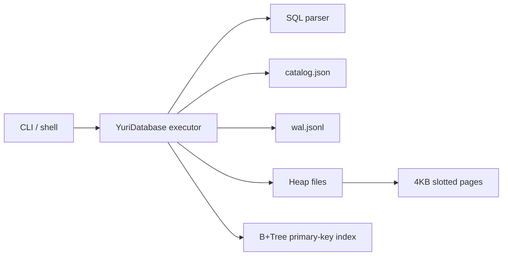

# Yuri DB Lab

[](https://github.com/yuribarbosacouto/yuri-db-lab/actions/workflows/ci.yml)
[](https://github.com/yuribarbosacouto/yuri-db-lab/actions/workflows/codeql.yml)

Yuri DB Lab is a from-scratch database systems project built in TypeScript. It is intentionally not another portfolio dashboard: it studies the engineering shape of large open-source systems and applies those lessons to a focused, inspectable storage engine.

The benchmark set for this project is architectural, not vanity-based. Linux, Chromium, TensorFlow, System Design Primer, and Build Your Own X are valuable because they expose layered design, deep documentation, reproducible workflows, testing discipline, and maintainable growth. Yuri DB Lab applies those same habits to a smaller but real system.

## What works today

- SQL parser for `CREATE TABLE`, `INSERT`, `SELECT`, `UPDATE`, `DELETE`, `BEGIN`, `COMMIT`, and `ROLLBACK`.
- File-backed heap storage built on 4KB slotted pages.
- JSONL write-ahead log for table and row mutations.
- In-memory B+Tree primary-key index rebuilt from heap files at startup.
- Transaction queue with commit and rollback for write statements.
- CLI with one-shot SQL execution and interactive shell.
- Benchmark runner for inserts, primary-key point reads, and heap scans.
- Vitest coverage for parser, B+Tree behavior, persistence, transactions, and mutation paths.
- GitHub Actions CI, CodeQL, Dependabot, and GitHub Pages documentation.

## Quickstart

```bash
npm install
npm run build
node apps/cli/dist/index.js exec --dir .ydb --sql "create table users (id int primary key, name text not null, age int);"
node apps/cli/dist/index.js exec --dir .ydb --sql "insert into users (id, name, age) values (1, 'Yuri', 23);"
node apps/cli/dist/index.js exec --dir .ydb --sql "select * from users where id = 1;"
```

Run the interactive shell:

```bash
node apps/cli/dist/index.js shell --dir .ydb
```

Run quality gates:

```bash
npm run quality
```

Run a benchmark:

```bash
npm run bench -- --rows 1000
```

## Example output

```text
created table users (3.646 ms)
inserted 1 row into users (2.806 ms)
selected 1 rows via primary-key index (0.789 ms)
```

## Architecture



## Project map

```text
packages/core/src
  btree/       B+Tree implementation
  catalog/     table metadata and schema validation
  database/    SQL execution, transactions, indexes
  sql/         parser and predicate evaluation
  storage/     page file, slotted page, heap file
  wal/         write-ahead log
apps/cli       command-line SQL runner and shell
apps/bench     reproducible local benchmark
docs/          architecture, SQL dialect, storage internals, roadmap
```

## SQL dialect

The dialect is deliberately small and testable:

```sql
create table users (id int primary key, name text not null, age int);
insert into users (id, name, age) values (1, 'Yuri', 23);
select id, name from users where id = 1;
update users set name = 'Barbosa' where id = 1;
delete from users where id = 1;
begin;
insert into users (id, name) values (2, 'Ana');
commit;
```

See [docs/SQL_DIALECT.md](docs/SQL_DIALECT.md) for details.

## Design goals

- Prefer a working vertical slice over a fake high-fidelity UI.
- Keep the system small enough to study end-to-end.
- Document internals the way serious open-source projects do.
- Make every claim testable with a local command.
- Grow toward more ambitious systems features through explicit milestones.

## Current limits

- The WAL is append-only and transparent, but crash recovery is planned rather than complete.
- The B+Tree index is rebuilt at startup instead of persisted as its own page file.
- Transactions queue writes and apply them at commit; they are not MVCC or fully isolated.
- SQL support is intentionally minimal and does not include joins, aggregation, or query planning yet.

## Roadmap

The next milestones are recovery replay, persistent B+Tree pages, query planning, secondary indexes, property-based tests, and a small documentation site with diagrams and benchmarks. See [docs/ROADMAP.md](docs/ROADMAP.md).

## References that shaped the scope

- [Linux kernel](https://github.com/torvalds/linux)
- [Chromium](https://github.com/chromium/chromium)
- [TensorFlow](https://github.com/tensorflow/tensorflow)
- [System Design Primer](https://github.com/donnemartin/system-design-primer)
- [Build Your Own X](https://github.com/codecrafters-io/build-your-own-x)

## License

MIT
