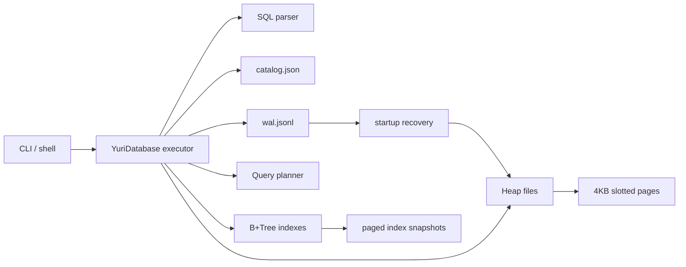

# Yuri DB Lab

Technical-depth lab in the portfolio: a from-scratch database systems study that explains parser, storage, indexes, WAL, query planning, and recovery beneath the kinds of systems shown in OpsFlow.

[](https://github.com/yuribarbosacouto/yuri-db-lab/actions/workflows/ci.yml)
[](https://github.com/yuribarbosacouto/yuri-db-lab/actions/workflows/codeql.yml)

Yuri DB Lab is a from-scratch database systems project built in TypeScript. It is intentionally not another portfolio dashboard: it studies the engineering shape of large open-source systems and applies those lessons to a focused, inspectable storage engine.

The benchmark set for this project is architectural, not vanity-based. Linux, Chromium, TensorFlow, System Design Primer, and Build Your Own X are valuable because they expose layered design, deep documentation, reproducible workflows, testing discipline, and maintainable growth. Yuri DB Lab applies those same habits to a smaller but real system.

## Maturity Snapshot

This project is a technical lab, not a production database. The implemented features are real and tested, but durability, query planning, and indexing are intentionally scoped for study.

## Implemented

- SQL parser for `CREATE TABLE`, `INSERT`, `SELECT`, `UPDATE`, `DELETE`, `BEGIN`, `COMMIT`, and `ROLLBACK`.
- File-backed heap storage built on 4KB slotted pages.
- Page-level checksum manifests for persisted heap pages.
- JSONL write-ahead log for table and row mutations.
- Commit markers with logical record counts for transaction batch validation.
- In-memory B+Tree primary-key index rebuilt from heap files at startup.
- Secondary indexes with `CREATE INDEX` and `CREATE UNIQUE INDEX`.
- Page-backed B+Tree index snapshots with meta, leaf, and internal pages under `indexes/*.idx`.
- Mutable page-backed index inserts with leaf/internal splits and root replacement.
- Query planner that explains primary-key lookup, secondary-index lookup, index-ordered scan, or heap scan.
- `ORDER BY` and `LIMIT` for `SELECT`.
- Persisted index snapshots under the database directory.
- Automatic WAL replay when opening a database, including redo for committed records and undo for incomplete transaction batches.
- WAL-based recovery into a fresh database directory through an explicit CLI command.
- Transaction queue with commit and rollback for write statements.
- CLI with one-shot SQL execution and interactive shell.
- Benchmark runner for inserts, primary-key point reads, secondary-index reads, and heap scans.
- Vitest coverage for parser, B+Tree behavior, persistence, transactions, and mutation paths.
- GitHub Actions CI, CodeQL, Dependabot, and GitHub Pages documentation.

## Partial / Experimental

- B+Tree index inserts mutate page-backed files, but delete/rebalance still rebuilds indexes.
- Checksums detect corrupted heap pages, but the engine does not yet repair damaged pages.
- Startup recovery replays the logical WAL, but this lab does not yet model fsync policy or atomic directory swaps.
- Transactions queue writes and apply them at commit; there is no MVCC or isolation model yet.
- The planner explains index-vs-scan choices, but it is still rule-based rather than cost-based.

## Next Steps

- Fsync strategy and stronger torn-write handling.
- B+Tree delete/rebalance and direct on-disk index search.
- Cost estimates based on row count, selectivity, and index cardinality.
- Joins, aggregation, and a stricter SQL grammar.
- Property-based tests for parser, page layout, and WAL replay invariants.

## Quickstart

```bash
npm install
npm run build
node apps/cli/dist/index.js exec --dir .ydb --sql "create table users (id int primary key, name text not null, age int);"
node apps/cli/dist/index.js exec --dir .ydb --sql "insert into users (id, name, age) values (1, 'Yuri', 23);"
node apps/cli/dist/index.js exec --dir .ydb --sql "select * from users where id = 1;"
node apps/cli/dist/index.js exec --dir .ydb --sql "create index idx_users_age on users (age);"
node apps/cli/dist/index.js exec --dir .ydb --sql "select id, age from users where age = 23 order by id desc limit 1;"
```

Run the interactive shell:

```bash
node apps/cli/dist/index.js shell --dir .ydb
```

Run quality gates:

```bash
npm run quality
```

Run a benchmark:

```bash
npm run bench -- --rows 1000
```

Recover a database from its WAL into a new directory:

```bash
node apps/cli/dist/index.js recover --from .ydb --to .ydb-recovered
```

Inspect automatic startup recovery from code:

```ts
const db = new YuriDatabase(".ydb");
console.log(db.startupRecovery());
```

## Example output

```text
created table users (4.067 ms)
inserted 1 row into users (3.672 ms)
created index idx_users_age on users(age) (2.323 ms)
plan: secondary-index (Predicate column age has a secondary index.)
selected 1 rows via secondary-index (1.773 ms)
```

## Architecture



## Project map

```text
packages/core/src
  btree/       B+Tree implementation
  catalog/     table metadata and schema validation
  database/    SQL execution, transactions, indexes
  planner/     query planning decisions
  sql/         parser and predicate evaluation
  storage/     page file, slotted page, heap file
  wal/         write-ahead log
apps/cli       command-line SQL runner and shell
apps/bench     reproducible local benchmark
docs/          architecture, SQL dialect, storage internals, roadmap
```

Key architecture decisions:

- [ADR 001: Build a database systems lab](docs/ADR-001-database-lab.md)
- [ADR 002: Startup WAL recovery](docs/ADR-002-startup-wal-recovery.md)
- [ADR 003: Page checksums and commit marker validation](docs/ADR-003-checksums-and-commit-markers.md)
- [ADR 004: Page-backed B+Tree index snapshots](docs/ADR-004-page-backed-index-snapshots.md)
- [ADR 005: Mutable page-backed index inserts](docs/ADR-005-mutable-index-inserts.md)

## SQL dialect

The dialect is deliberately small and testable:

```sql
create table users (id int primary key, name text not null, age int);
create index idx_users_age on users (age);
insert into users (id, name, age) values (1, 'Yuri', 23);
select id, name from users where age >= 18 order by age desc limit 10;
update users set name = 'Barbosa' where id = 1;
delete from users where id = 1;
begin;
insert into users (id, name) values (2, 'Ana');
commit;
```

See [docs/SQL_DIALECT.md](docs/SQL_DIALECT.md) for details.

## Design goals

- Prefer a working vertical slice over a fake high-fidelity UI.
- Keep the system small enough to study end-to-end.
- Document internals the way serious open-source projects do.
- Make every claim testable with a local command.
- Grow toward more ambitious systems features through explicit milestones.

## Roadmap

The next milestones are direct on-disk index search, B+Tree delete/rebalance, fsync strategy, property-based tests, and benchmark history. See [docs/ROADMAP.md](docs/ROADMAP.md).

## References that shaped the scope

- [Linux kernel](https://github.com/torvalds/linux)
- [Chromium](https://github.com/chromium/chromium)
- [TensorFlow](https://github.com/tensorflow/tensorflow)
- [System Design Primer](https://github.com/donnemartin/system-design-primer)
- [Build Your Own X](https://github.com/codecrafters-io/build-your-own-x)

## License

MIT
