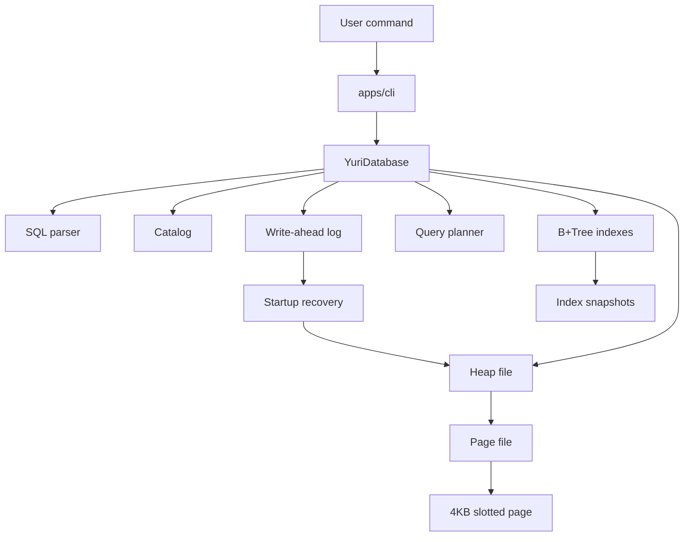

# Architecture

Yuri DB Lab is organized as a storage-engine vertical slice. The goal is to keep the surface small while making the internals real enough to inspect, test, and extend.

## Layers



## Execution path

1. The CLI passes SQL text to `YuriDatabase.execute`.
2. `parseSql` converts text into a typed statement.
3. The database validates table and column metadata through the catalog.
4. Mutating statements append an intent to the WAL.
5. Rows are stored in heap files using slotted pages.
6. The planner chooses primary-key index, secondary index, index-ordered scan, or heap scan.
7. B+Tree indexes resolve row ids when a query can use an index.
8. On startup, committed WAL records are replayed and incomplete transaction batches are undone.
9. Results are ordered, limited, and projected into `QueryResult`.

## Persistence model

Each database directory contains:

```text
catalog.json       table schemas
wal.jsonl          append-only mutation log
tables/*.heap      file-backed table data
tables/*.heap.checksums.json page checksum manifests
indexes/*.idx.json persisted index snapshots
```

The heap file is durable and each written page has a checksum entry. Index snapshots are persisted and can also be rebuilt from heap rows. Startup recovery replays committed logical WAL records, validates transaction commit markers when present, and undoes incomplete transaction batches. The explicit CLI recovery command can still rebuild a fresh database directory from logged operations.

## Why this shape

Large systems such as kernels, browsers, and ML frameworks survive by separating core responsibilities, documenting subsystem boundaries, and making quality checks routine. This project borrows that engineering discipline without pretending to match their scale.

## Extension points

- Fsync strategy and stronger torn-write handling.
- Persistent B+Tree pages.
- Secondary indexes.
- Query planner with scan/index cost choices.
- Joins and aggregation.
- Fuzz/property tests for parser and storage invariants.
